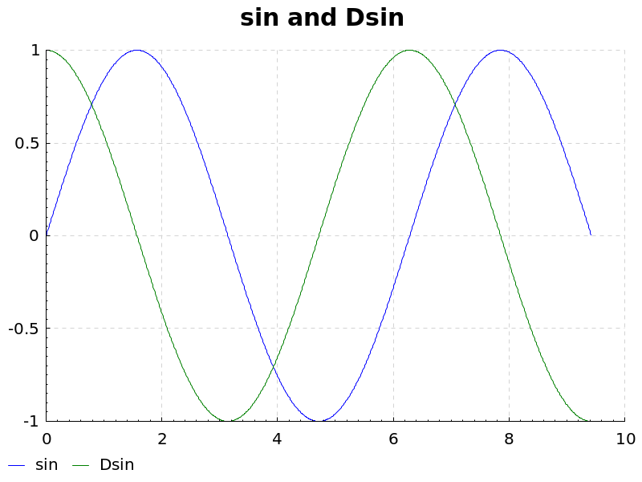
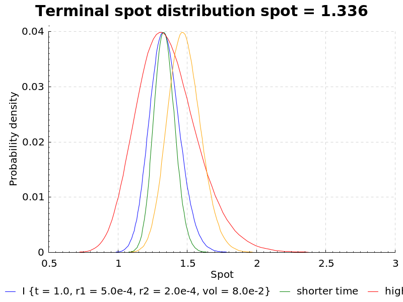
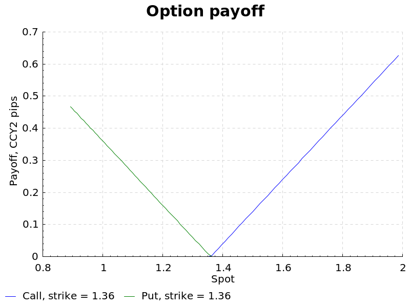

# Automatic differentiation and FX options pricing

An experiment with AD and Black-Scholes-Merton option pricing.

## Contents

[**`Forward.hs`**][fwd] defines a simple framework for forward mode differentiation,
inspired by Conal Elliot's ["Beautiful Differentiation"][1] and Edward Kmett's
[ad][].

[1]: http://conal.net/papers/beautiful-differentiation/
[ad]: https://hackage.haskell.org/package/ad
[fwd]: ./Forward.hs

[**`Ex.hs`**][ex] uses the Haskell library Chart to plot `sin` and it's
derivative to sanity check the AD implementation:

[ex]: ./Ex.hs

[**`Options1.hs`**][options1] works through the practical B of "FX Derivatives - Trader School".
Looking at the terminal spot distribution and how it is affected by various
factors:

We can also look at the option payoff graphs, pretty!

[options1]: ./Options1.hs

[**`Bs.hs`**][bs] implements the BSM vanilla options pricing model and compares
AD to the analytic solutions for the the delta (dPrice/dSpot) and vega
(dPrice/dVol) "greeks". I'm happy to see that AD gives me the same answer as
the analytic solution. There is also a spot ladder scenario generator.

[bs]: ./Bs.hs
